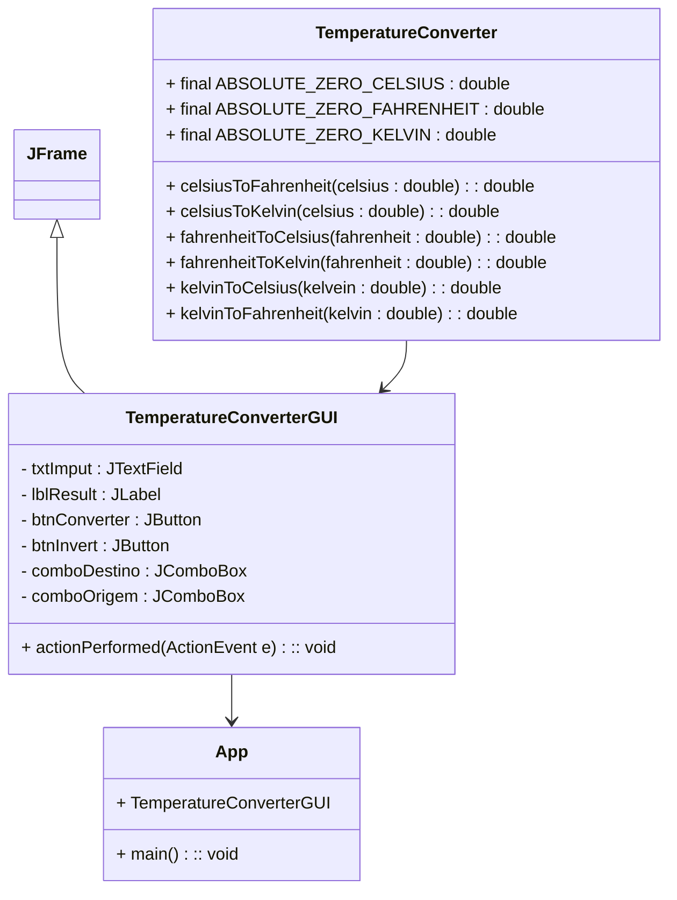

# Mini Projeto: Conversor de temperatura.

Profº.: Cainã Antunes Silva  
Tecnólogo em Análise e Desenvolvimento de Sistemas (ADS)
___

> O objetivo deste mini projeto é praticar o uso das Classes Java apresentadas em aula. Além disso esta atividade ajudará a compreender o funcionamento de classes estáticas, modificador final, sobrecarga de métodos e exceções.  

O reaproveitamento de código é essencial no desenvolvimeto de aplicações complexas, portanto é fundamental conhecer algumas ferramentas  básicas disponibilizadas pela comunicadade de desenvolvedores através de softwares e bibliotecas de código aberto, bem como saber interpretar suas documentações.

Para mais informações acesse [Aula 03: Classes Java.](https://cainaantunes.notion.site/Aula-03-Classes-Java-3b1bde521b3b80719101f3bfcee66fcc?source=copy_link) e [Aula 04: Exceções](https://cainaantunes.notion.site/Aula-04-Exceptions-Exce-es-3b1bde521b3b801da213e5d44df1a4e3?source=copy_link)

***

## Descrição do Projeto:
   
Você foi contratado para desenvolver uma pequena biblioteca de utilidades que permita a conversão entre diferentes unidades de temperatura.

> Utilizando a Interface Gráfica previamente desenvolvida com `javax.swing` implemente uma classe em Java que permita ao usuário converter temperaturas entre Celsius, Fahrenheit e Kelvin.

O sistema deverá atender aos seguintes requisitos:

1. A classe deve se chamar `TemperatureConverter`.
2. A classe deve ser estática, pois não faz sentido criar instâncias para ela.
    > **Como cria classes estáticas em Java:** Declare a classe como public (ou final para impedir herança).Crie um construtor privado para impedir que outras partes do código usem o operador new. Adicione apenas métodos e atributos static.
3. Devem existir métodos para conversão entre todas as principais escalas de temperatura: Celsius (°C), Fahrenheit (°F) e Kelvin (K).
4. Cada método deverá ser público e estático e receber um valor `double` como parâmetro, retornando também um `double`.
5. Se atentar à valores abaixo do zero absoluto.

**Diagrama de Classes:**

> **Como implementar o projeto:** Crie sua classe dentro da pasta models. Depois utilize-a dentro da classe `TemperatureConverterGUI` no espaço indicado com comentários, procure por **INTEGRAÇÃO DA CLASSE DE CONVERSÃO AQUI**. Não é necessário alterar outras partes do projeto.

**Fundamentos teóricos:**

    

$$
\frac{C}{5}=\frac{(F-32)}{9}=\frac{(K-273)}{5}
$$
***

# Extra: Criar Interfaces com `javax.swing`

O `javax.swing` é uma biblioteca para criar interfaces gráficas Desktop em Java. Ela possui total controle sobre a renderização, permitindo que a janela tenha o mesmo design independente do sistema operacional.

Veja a seguir alguns componentes disponibiliza pela bilbioteca: 

| Componente | Função no Projeto | Principais Métodos |
| :--- | :--- | :--- |
| **JFrame** | Janela principal que agrupa e exibe todos os outros elementos. | `setSize()`, `setVisible()`, `setDefaultCloseOperation()` |
| **JTextField** | Caixa de entrada de texto onde o usuário digita o número. | `getText()`, `setText()`, `setHorizontalAlignment()` |
| **JLabel** | Rótulo de texto estático usado para exibir os resultados. | `setText()`, `getText()` |
| **JButton** | Botão que age como gatilho para executar a conversão. | `addActionListener()`, `doClick()` |
| **JComboBox** | Lista suspensa usada para escolher as escalas. | `getSelectedItem()`, `setSelectedItem()` |

> ### A mecânica dos Eventos: `ActionListener` e `ActionEvent`
> O Java trabalha com a Orientação a Eventos utilizando "ouvintes". O `ActionListener` atua como um radar conectado a um componente (como o `JButton`). Quando o botão é clicado, o Java empacota todas as informações desse clique em um objeto chamado `ActionEvent` e o envia. O ouvinte captura essa "mensagem" instantaneamente através do método `actionPerformed` e executa a ação contida em sua implementação.

***